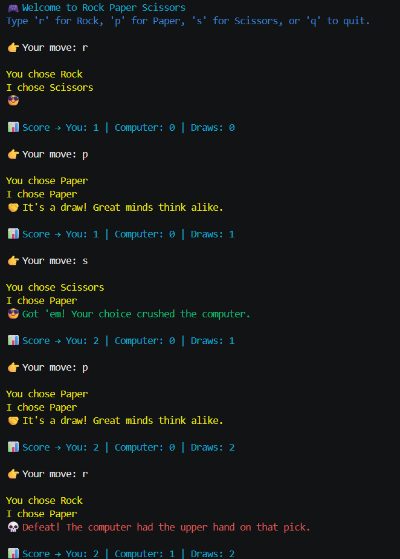
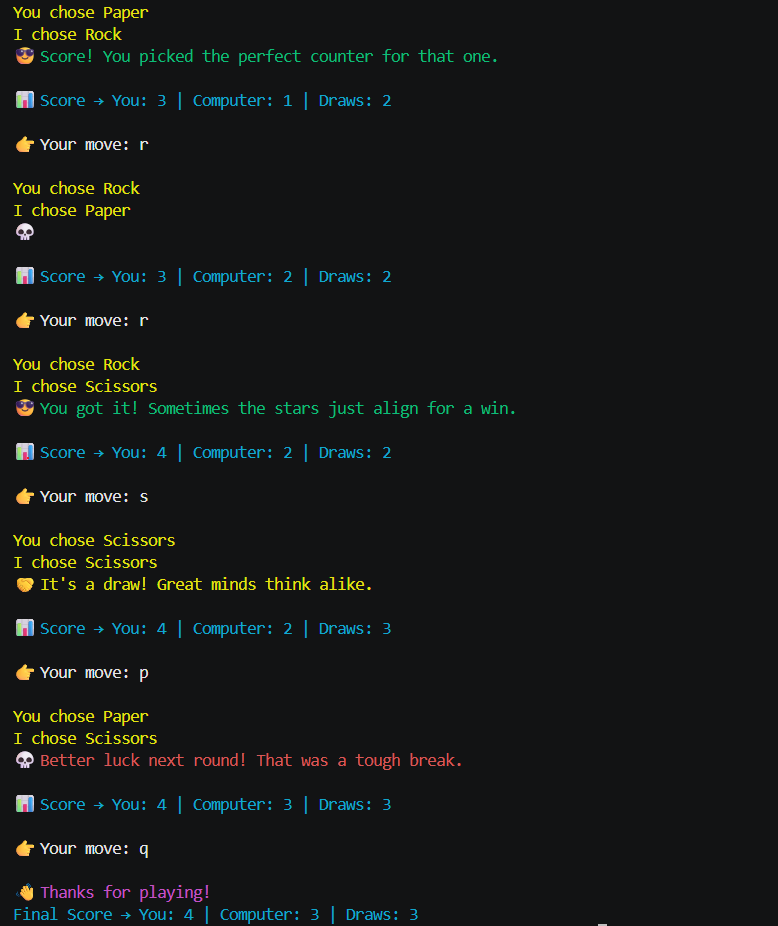

# 🎮 Rock Paper Scissors --- Personality-Driven CLI Game

A thoughtfully designed command-line Rock Paper Scissors game built in
Python that transforms a classic game into an engaging,
personality-driven experience using dynamic response generation and
enhanced CLI visuals.

------------------------------------------------------------------------

## ✨ Highlights

-   🎲 Dynamic Gameplay --- Each round feels fresh with randomized
    outcomes and responses\
-   💬 Personality-Driven Responses --- External files power expressive,
    non-repetitive reactions\
-   🎨 Enhanced CLI Experience --- Colored terminal output using
    Colorama\
-   📊 Live Score Tracking --- Tracks wins, losses, and draws\
-   🔁 Continuous Play Mode --- Play multiple rounds seamlessly\
-   🧠 Clean Logic Design --- Simple and scalable implementation

------------------------------------------------------------------------

## 🧠 Concept Behind the Project

This project enhances a basic CLI game by using external text files to
generate dynamic responses.\
Each outcome triggers a randomized reaction, making gameplay more
interactive and less repetitive.

------------------------------------------------------------------------

## 📸 Gameplay Preview

  
  

------------------------------------------------------------------------

## 🛠️ Tech Stack

-   Python\
-   File Handling\
-   Random Module\
-   Colorama

------------------------------------------------------------------------

## 📂 Project Structure

rock-paper-scissors/\
│── main.py\
│── win_list_professional.txt\
│── lose_list_professional.txt\
│── assets/\
│ └── gameplay.png

------------------------------------------------------------------------

## ▶️ How to Run

git clone
https://github.com/optimus-dev-shubham/rock-paper-scissors.git\
cd rock-paper-scissors\
pip install colorama\
python main.py

------------------------------------------------------------------------

## 🎮 Controls

r → Rock\
p → Paper\
s → Scissors\
q → Quit Game

------------------------------------------------------------------------

## 👨‍💻 Author

Shubham Yadav\
https://github.com/optimus-dev-shubham

------------------------------------------------------------------------

## ⭐ If you found this project interesting, consider giving it a star!
